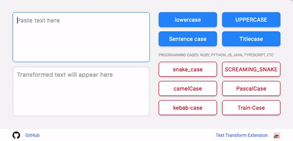

<div align="center">
  <h1>Text Transform Extension</h1>
  
</div>

Description: Chrome Extension for easily changes the regional texture: lower region, UPPER REGISTER, change of capital letters in review on the upper region.

# Link to browser extensions

### [Text Transform - Chrome Web Store](https://chromewebstore.google.com/detail/text-transform/lngoloonfgohfhnpcgkfgnfikeedbhgg) <a href="https://chrome.google.com/webstore/detail/autoviewed/occcjmolphcfebdeichmoflmfgeefjef"></a>

### History

On 03.2025: Installs: 731 | Stars: 5 | Version 2.0 | Last update: 2 Dec 2020


# Development

1. Open file *src/environments/environment.ts* and *src/environments/environment.ts* and update variables for Google Analytics:

```console
GA_MEASUREMENT_ID=take_from_google_analytics
GA_API_SECRET=take_from_google_analytics
```

2. Run command:

```console
$ ng build --watch
```

3. Open chrome and input: chrome://extensions/
4. Enable 'Developer mode'
5. Click 'Load unpacked' and choose a path/to/the/extension/dist/text-transform
6. click 'Enabled'

# Production

```console
$ ng build --configuration production --output-hashing none
```

This project was generated with [Angular CLI](https://github.com/angular/angular-cli) version 8.3.20. Current version of Angular CLI 19.2.8

[//]: # (## Development server)

[//]: # (Run `ng serve` for a dev server. Navigate to `http://localhost:4200/`. The app will automatically reload if you change any of the source files.)

[//]: # ()
[//]: # (## Build)

[//]: # ()
[//]: # (Run `ng build` to build the project. The build artifacts will be stored in the `dist/` directory. Use the `--prod` flag for a production build.)

## TODO

- [ ] Add words counter

- [ ] Add testing (https://angular.dev/guide/testing)

- [ ] Code refactoring: Use ngSrc (NgOptimizedImage directive) to improve performance

- [ ] Code refactoring: (input)="inputChange($event.target.value)"

- [ ] Return Future: insert selected text from a browser to extension

```angular

// declare var chrome;


   await chrome.storage.local.set({clientId});
   await chrome.storage.local.get('clientId');
   await getOrCreateClientId();
  
  ngOnInit() {
    ...
  
    // TODO Future: insert selected text
    chrome.tabs.query({active: true}, function(tabs) {
      const tab = tabs[0];
      if (tab.url?.startsWith('chrome://')) {
        this.sendEventToAnalytics('OpenOnChrome');
        console.log('Open on chrome://');
        return undefined;
      }
      
      if getSelection empty {
        return;
      }
      else { 
        continue
        this.sendEventToAnalytics('getSelection');
      }
      
      try {
        chrome.scripting.executeScript(
          {
            target: {tabId: tab.id},
            function: () => {
              // alert(getSelection().toString());
              // document.getElementById('text-input').focus();
              // document.getElementById('text-input').innerHTML = getSelection().toString();

              chrome.storage.local.set({selectedText: getSelection().toString()});
              // chrome.storage.local.set({selectedText: getSelection().toString().trim().replace(/\s\s+/g, ' ')});
            }
          }
        );
      } catch (err) {
        console.error(`failed to execute script: ${err}`);
      }
    });
    this.pasteSelectedText();
    
    ...
  }

  // // TODO Future: insert selected text
  // pasteSelectedText() {
  //   chrome.storage.local.get(['selectedText']).then((result) => {
  //     this.textAreaInput.nativeElement.focus();
  //     this.textAreaInput.nativeElement.value = result.selectedText;
  //     console.log('selectedText: ' + result.selectedText);
  //   });
  //   chrome.storage.local.remove('selectedText');
  // }

```

- https://developer.chrome.com/docs/extensions/reference/api/storage?hl=ru#sync
- https://stackoverflow.com/questions/66788838/chrome-scripting-executescript-unexpected-property-arguments
- https://stackoverflow.com/questions/76994233/how-to-get-user-selected-text-in-chrome-extension-manifest-v3

- [x] Chrome Extensions | Migrate from Manifest V2 to Manifest V3  

- [x] Update to Google Analytics 4
- https://analytics.google.com/analytics/web
- https://developer.chrome.com/docs/extensions/how-to/integrate/google-analytics-4?hl=ru
- https://github.com/GoogleChrome/chrome-extensions-samples/tree/main/functional-samples/tutorial.google-analytics
- https://js2ts.com/conversion/054c22c4-cd84-4125-b0e8-430b531fa02a
- https://stackoverflow.com/questions/64408056/google-analytics-4-and-the-measurement-protocol-api

- https://netpeak.net/blog/how-to-work-with-measurement-protocol-in-google-analytics-4/
- https://www.optimizesmart.com/what-is-measurement-protocol-in-google-analytics-4-ga4/

- [x] Fix onload="this.media='all'"
- https://stackoverflow.com/questions/67834294/how-prevent-angular12-rendering-a-onload-property-on-the-link-tag-when-usin


## Fix Bugs 

- [x] йцукенгшщзхїфівапролджєячсмитьбю → йцукенгшщзх ф вапролдж ячсмитьбю

- [x] pt with the replace() method and → Pt-With-The-Replace)-Method-And

- [x] a how as. s . s → aHowAsS.S

- [x] Google-analytics.service -> Googleanalytics.service

## Info
[Chrome extension with Angular — from zero to a little hero](https://medium.com/angular-in-depth/chrome-extension-with-angular-why-and-how-778200b87575)

# Change Log

```console
0. version 0.0.0 (21.12.2019)
1. version 1.1.0 (07.02.2020)
2. version 1.2.0 (24.02.2020)
3. version 1.3.0 (29.03.2020)
4. version 2.0.0 (27.12.2020)
5. version 2.1.0 (05.05.2025)
```
